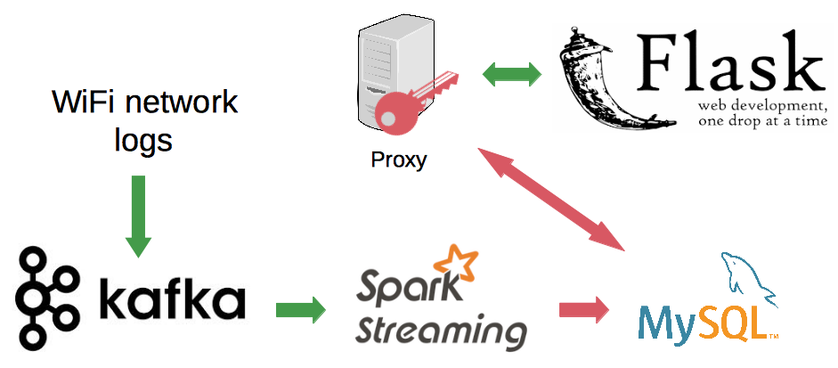

# Privacy Please: Preserving User Privacy in a Smart Building Era

# Table of Contents
1. [Introduction](README.md#introduction)
2. [Details of Implementation](README.md#details-of-implementation)
3. [Repo directory structure](README.md#repo-directory-structure)

# Introduction
This application is designed to preserve user privacy by encrypting streaming WiFi logs. The challenge is to encrypt time ranges in the logs and then to make queries over the encrypted data. The application supports the following features:

**Feature 1:** Encrypt time range fields in WiFi logs.

**Feature 2:** Queries involve a time range. Be able to query over encrypted time ranges.

**Feature 3:** Support 2 Smart building applications: "User presence check" and "People counting".

The project's URL is available at [http://privacyplease.website](privacyplease.website).

# Details of Implementation
The project used Kafka, Spark Streaming, MySQL and Flask to implement an end-to-end data pipeline on Amazon Web Services (AWS).

## Pipeline
A producer (written in Python) reads WiFi logs from a csv file and streams to Kafka. Each line in the stream has the following tab-separated fields:

 - Client IP Address
 - Client MAC Address
 - Association Time
 - Vendor
 - Access Point Name
 - Device Name
 - Map Location
 - SSID
 - Profile
 - VLAN ID
 - Protocol
 - Session Duration
 - Policy Type
 - Avg. Session Throughput (Kbps)

The consumer (Spark Streaming) receives the data stream, encrypts the stream and inserts the data into MySQL:

 - Client MAC Address
 - Access Point Name
 - Time Ranges
 - Session Duration

Data processing is performed in a privacy-preserving fashion without them being ever revealed in plaintext to the data processing server.

